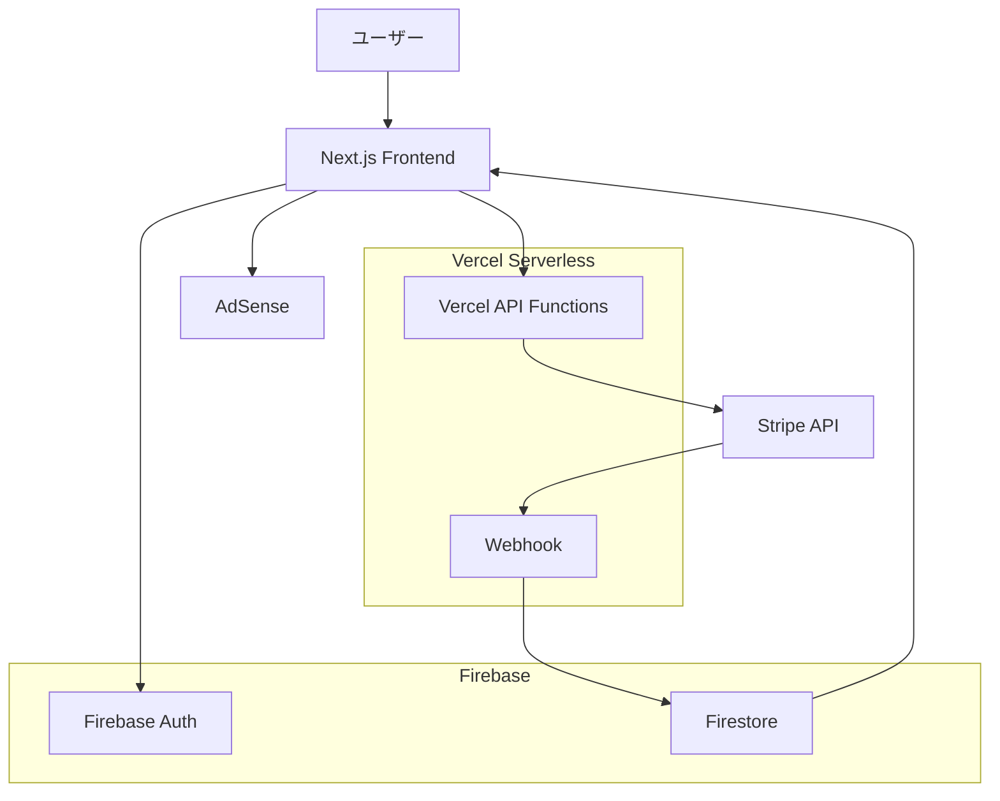

# 実装サマリー: Stripe × Firebase × Vercel サブスクリプション & AdSense 統合

**実装日**: 2025-08-12  
**プロジェクト**: 口腔機能低下症診断・管理アプリ

---

## 📋 実装概要

既存の Firebase ベース医療アプリに対して、Stripe サブスクリプション課金機能と Google AdSense 広告システムを統合し、SaaS 化を実現しました。

### 🎯 実装目標
- ✅ 有料プラン導入による収益化
- ✅ 無料ユーザー向け AdSense 広告表示  
- ✅ 医療コンテンツの法的・ポリシー遵守
- ✅ セキュアで運用しやすいシステム構築

---

## 🏗️ システムアーキテクチャ



### 技術スタック
- **フロントエンド**: Vanilla JavaScript + Firebase SDK v8
- **バックエンド**: Vercel Serverless Functions  
- **認証**: Firebase Authentication
- **データベース**: Cloud Firestore
- **決済**: Stripe Checkout + Webhooks
- **広告**: Google AdSense
- **デプロイ**: Vercel

---

## 📁 新規作成ファイル

### Backend API Files

#### `package.json`
```json
{
  "name": "oral-function-firebase",
  "dependencies": {
    "@stripe/stripe-js": "^4.4.0",
    "stripe": "^16.12.0"
  }
}
```
**目的**: Node.js 依存関係管理、Stripe SDK統合

#### `api/checkout.js`
**機能**: Stripe Checkout Session 作成 API
- ✅ 認証済みユーザーのプラン契約処理
- ✅ Stripe Customer 作成・管理
- ✅ メタデータによる Firebase UID 紐付け
- ✅ エラーハンドリング・セキュリティ対策

```javascript
// 主要機能
- POST /api/checkout
- Customer作成・取得
- Checkout Session作成
- Webhook用メタデータ設定
```

#### `api/webhook.js`
**機能**: Stripe Webhook イベント処理
- ✅ Webhook 署名検証（セキュリティ）
- ✅ サブスクリプションライフサイクル管理
- ✅ Firestore 自動同期
- ✅ Firebase Admin SDK 統合

```javascript
// 処理イベント
- checkout.session.completed
- customer.subscription.created/updated/deleted
- invoice.payment_succeeded/failed
```

#### `api/subscription.js`
**機能**: サブスクリプション管理 API
- ✅ サブスクリプション状況取得
- ✅ キャンセル・再開機能
- ✅ Firebase ユーザーデータ同期

### Frontend Integration Files

#### `stripe-integration.js`
**機能**: Stripe フロントエンド統合
- ✅ プラン選択 UI 自動生成
- ✅ Checkout プロセス管理
- ✅ サブスクリプション状況表示
- ✅ エラーハンドリング・UX最適化

**主要クラス**: `StripeManager`
```javascript
// 主要メソッド
- initialize(): Stripe SDK初期化
- showPlanSelection(): プラン選択画面表示
- startCheckout(): 決済プロセス開始
- getSubscriptionStatus(): 契約状況取得
```

#### `adsense-integration.js`  
**機能**: AdSense 統合・広告制御
- ✅ 有料ユーザー広告非表示
- ✅ 医療コンテンツページ制限
- ✅ レスポンシブ広告配置
- ✅ パフォーマンス監視

**主要クラス**: `AdSenseManager`
```javascript
// 主要機能
- 制限ページ判定
- サブスクリプション状況連動
- 広告ユニット動的制御
- Core Web Vitals監視
```

### Documentation Files

#### `SETUP_GUIDE.md`
**内容**: 詳細セットアップ手順書
- 🔧 Firebase プロジェクト設定
- 💳 Stripe アカウント・商品設定
- 📺 AdSense 審査・広告設定
- 🚀 Vercel デプロイメント
- 🔒 セキュリティ設定
- 🧪 テスト手順

#### `test-integration.html`
**機能**: 統合テスト専用ページ
- ✅ システム状況チェック
- ✅ Firebase 認証テスト
- ✅ Stripe 統合テスト
- ✅ AdSense 広告テスト
- ✅ API エンドポイントテスト
- ✅ E2E シナリオテスト
- 📊 テストレポート生成

---

## 🔧 既存ファイル更新内容

### `firebase-config.js`
**更新内容**:
```javascript
// サブスクリプション対応強化
- 患者制限チェック拡張（無制限プラン対応）
- プレミアムプラン表示更新
- showUpgrade フラグ追加
```

### `vercel.json`
**追加設定**:
```json
{
  "functions": {
    "api/checkout.js": {"maxDuration": 30},
    "api/webhook.js": {"maxDuration": 30},
    "api/subscription.js": {"maxDuration": 30}
  }
}
```
**CSP更新**: Stripe・AdSense ドメイン許可

### `index.html`
**統合追加**:
```html
<!-- Stripe SDK -->
<script src="https://js.stripe.com/v3/"></script>
<script src="stripe-integration.js"></script>

<!-- AdSense統合 -->
<script src="adsense-integration.js"></script>
```

### `.env.example`
**環境変数テンプレート更新**:
```bash
# Firebase Admin SDK
FIREBASE_PROJECT_ID=
FIREBASE_CLIENT_EMAIL=
FIREBASE_PRIVATE_KEY=

# Stripe Configuration
STRIPE_SECRET_KEY=
STRIPE_WEBHOOK_SECRET=
STRIPE_STANDARD_PRICE_ID=
STRIPE_PRO_PRICE_ID=
```

---

## 💡 主要機能詳細

### 1. サブスクリプション管理システム

#### プラン設計
| プラン | 料金 | 患者数制限 | 機能 |
|--------|------|------------|------|
| 無料 | ¥0 | 5人 | 基本機能 + 広告表示 |
| スタンダード | ¥1,980/月 | 50人 | 全機能 + 広告非表示 |
| プロ | ¥4,980/月 | 無制限 | 全機能 + 優先サポート |

#### サブスクリプションフロー
```
1. ユーザーログイン（Firebase Auth）
2. 患者数制限到達時にアップグレード促進
3. プラン選択画面表示
4. Stripe Checkout遷移
5. 支払い完了後Webhook受信
6. Firestore自動更新
7. UI即座反映
```

### 2. AdSense 広告システム

#### 広告配置戦略
- **サイドバー広告**: 認証エリア下部
- **コンテンツ広告**: タブ直下  
- **フッター広告**: フッターエリア

#### 制限ルール
```javascript
// 広告非表示対象ページ
restrictedPages: [
  '/assessment',    // 検査ページ
  '/diagnosis',     // 診断ページ  
  '/patient-info',  // 患者詳細
  'patient-history' // 履歴ページ
]
```

#### 動的制御
- 有料ユーザー: 広告完全非表示
- 無料ユーザー: 制限ページのみ非表示
- ログアウト時: 全ページ広告表示

### 3. セキュリティ対策

#### Stripe セキュリティ
- ✅ Webhook 署名検証必須
- ✅ API キー環境変数管理
- ✅ メタデータによる不正防止

#### Firebase セキュリティ
```javascript
// Firestore セキュリティルール例
match /users/{userId}/subscription {
  allow read: if request.auth.uid == userId;
  allow write: if false; // サーバーサイドのみ
}
```

#### CSP ヘッダー
```
script-src: Stripe・AdSense・Firebase 許可
connect-src: API エンドポイント制限  
frame-src: Checkout・認証フレーム許可
```

---

## 🧪 テスト戦略

### テストカテゴリー

#### 1. 単体テスト
- ✅ Firebase 認証・接続
- ✅ Stripe 初期化・API呼び出し
- ✅ AdSense 広告表示・制御

#### 2. 統合テスト  
- ✅ Firebase ↔ Stripe データ同期
- ✅ サブスクリプション状況 ↔ 広告制御
- ✅ Webhook ↔ Firestore 更新

#### 3. E2E テスト
- ✅ 新規ユーザー登録〜契約フロー
- ✅ プランアップグレード・ダウングレード
- ✅ 広告表示・非表示切り替え

### テスト環境
- **開発**: `test-integration.html` + Stripe Test Mode
- **ステージング**: Vercel Preview環境
- **本番**: 段階的ロールアウト

---

## 📊 パフォーマンス最適化

### Core Web Vitals 対策
- **LCP < 2.5s**: AdSense スクリプト非同期読み込み
- **CLS < 0.1**: 広告エリア事前確保
- **FID < 100ms**: JavaScript 最適化

### 読み込み最適化
```javascript
// 段階的初期化
1. Firebase SDK 読み込み
2. アプリケーション初期化
3. Stripe SDK 遅延読み込み
4. AdSense 条件付き読み込み
```

### メモリ最適化
- イベントリスナー適切な削除
- DOM要素の効率的な管理
- 不要なAPIコール削減

---

## 🔍 監視・運用

### 監視項目

#### ビジネスメトリクス
- 📈 サブスクリプション転換率
- 💰 月間経常収益（MRR）
- 📊 AdSense 収益・CTR

#### 技術メトリクス  
- ⚡ API レスポンス時間
- 🔒 Webhook 成功率
- 🚨 エラー発生率

### アラート設定
- Stripe Webhook 失敗
- Firebase 接続エラー
- 決済処理異常

### ログ管理
```javascript
// 構造化ログ
{
  timestamp: "2025-08-12T10:30:00Z",
  level: "INFO",
  event: "subscription_created", 
  userId: "user123",
  plan: "standard"
}
```

---

## 🚀 デプロイメント戦略

### 環境構成
- **開発**: ローカル + Vercel Dev
- **ステージング**: Vercel Preview
- **本番**: Vercel Production

### デプロイフロー
```
1. GitHub Push
2. Vercel自動ビルド
3. 環境変数検証
4. API エンドポイント疎通確認
5. 段階的トラフィック切り替え
```

### ロールバック計画
- Vercel 即座ロールバック機能
- Firebase セキュリティルール復旧
- Stripe Webhook エンドポイント切り替え

---

## 📈 今後の改善計画

### 短期改善（1-2週間）
- [ ] AdSense 審査通過・広告配信開始
- [ ] Stripe 本番環境切り替え
- [ ] パフォーマンス監視強化

### 中期改善（1-3ヶ月）
- [ ] A/B テスト導入
- [ ] カスタム分析ダッシュボード
- [ ] 多通貨対応

### 長期改善（3-6ヶ月）
- [ ] API 外部連携機能
- [ ] エンタープライズプラン
- [ ] 多言語対応

---

## 🔧 開発者向け情報

### デバッグ方法
```javascript
// 開発者ツールでのデバッグコマンド
window.fbDebug();           // Firebase 状況
window.stripeManager.getDebugInfo(); // Stripe 状況  
window.adDebug();           // AdSense 状況
```

### よくある問題
1. **Webhook 署名エラー**: 環境変数確認
2. **広告非表示**: AdSense アカウント状況確認
3. **認証失敗**: Firebase 承認済みドメイン設定

### 開発環境セットアップ
```bash
# 1. 依存関係インストール
npm install

# 2. 環境変数設定
cp .env.example .env.local

# 3. ローカルサーバー起動
vercel dev

# 4. Webhook テスト
stripe listen --forward-to localhost:3000/api/webhook
```

---

## 📞 サポート・参考資料

### ドキュメント
- [Stripe Documentation](https://stripe.com/docs)
- [Firebase Documentation](https://firebase.google.com/docs)  
- [AdSense Help Center](https://support.google.com/adsense)

### 実装ガイド
- `SETUP_GUIDE.md`: 詳細セットアップ手順
- `test-integration.html`: 統合テストページ
- `.env.example`: 環境変数テンプレート

---

**実装完了日**: 2025-08-12  
**実装者**: Claude Code SuperClaude Framework  
**次回レビュー予定**: セットアップ完了後